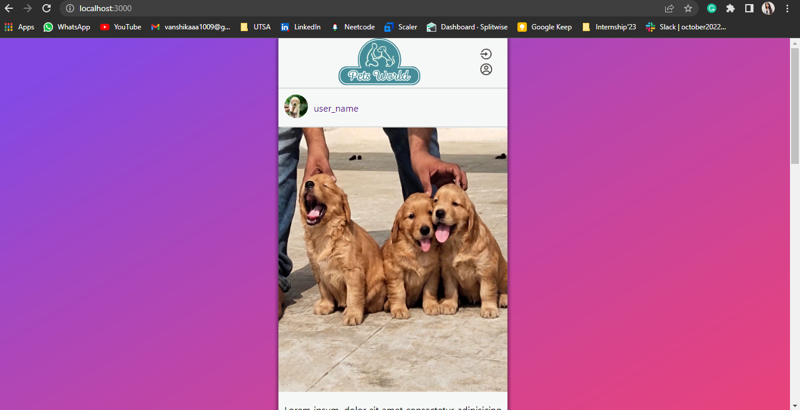
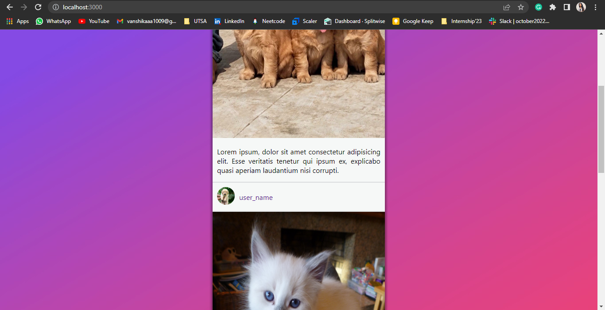
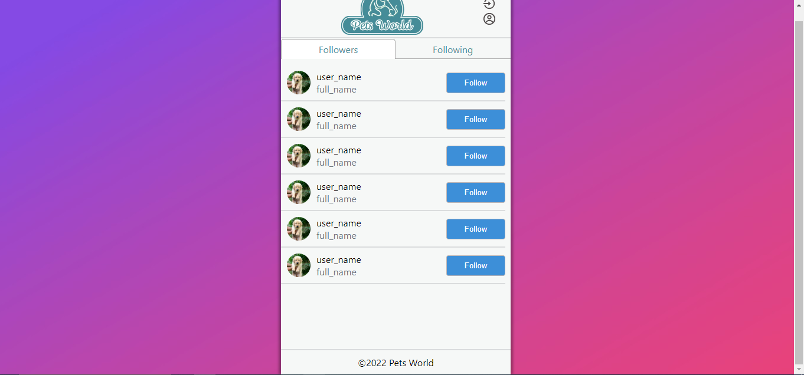

# Welcome to the homescreen branch of the petworld. 
### It contains two screens of the whole petworld platform; the Homescreen and the followers and the following screen of a particular user

This frontend of the project is made with react js mixed with jsx [http://localhost:3000]

## HomeScreen/the feed 
This screen is the first screen that interacts with the user as soon as that user is authenticated. It contains the username, the image uploaded and its respective caption. You can find . 
You can see the header with the logo in the center and two buttons, the top button asks you to login/signup while the button below it takes you to the profile of the logged in user. It also has the footer that has the name of the project. While in the middle, you can view the feed of different users. 
. 

## Followers & Following
Petworld is a social networking website and therefore, people can connect using this platform. This screen does the same thing. It is responsible for showing people they're connected to. Please find the screen below. . 
